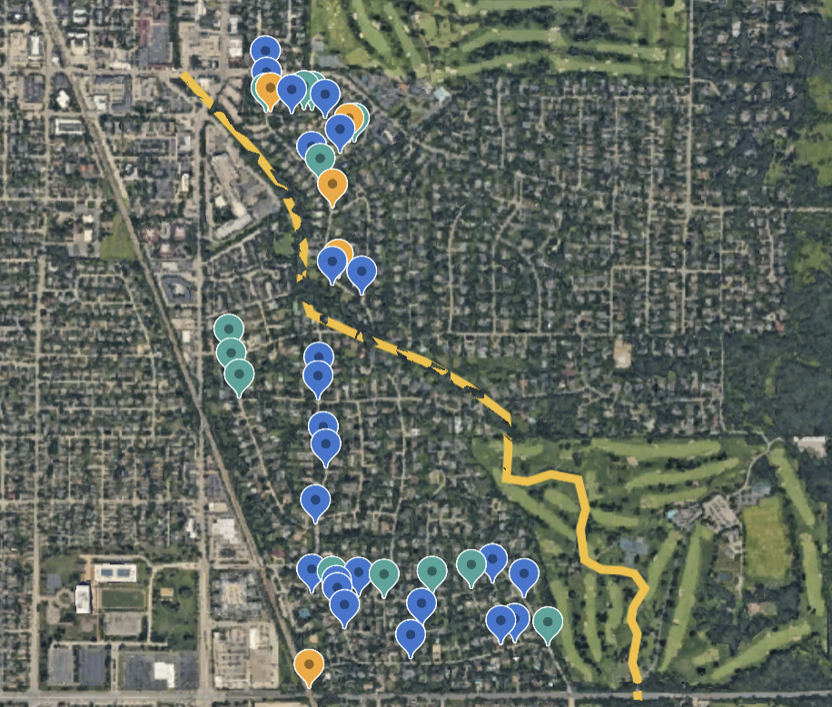

```{r setup, include=FALSE}
knitr::opts_chunk$set(echo = TRUE)
```

```{r libraries, include = FALSE}

library(tidyverse)
library(kableExtra)

```


```{r data, include = FALSE}

altosid = read.csv('data/altosid.csv')

# remove na cols and rows resulting from excel doc formatting
sumilarv = read.csv('data/sumilarv.csv')[1:2361,1:12]
colnames(sumilarv)[6] = 'Weeks.post'
sumilarv$Treatment[sumilarv$Treatment == 'Sumilarv WSP'] = 'Sumilarv 3 WSP'

pesticides = rbind(altosid, sumilarv)
```


Project Goals
- Determine if both types of pesticide (Sumilarv and Altosid) are equally effective
  - Effectiveness is determined by how quickly and efficiently pupae are eliminated from catch basins after being treated
  

Data Structure
- Each row represents the summed mosquito presence outcomes over 5 dips of a 350 ml dipper at a distinct basin
- Map sites are 1 sq mile plots which contain labeled basin locations, where each basin location each represents between 1 and 12 individual catch basins

    
```{r, echo = FALSE}


maps_locs = pesticides %>%
  group_by(Treatment) %>%
  summarize(MapSites = n_distinct(Map), 
            BasinLocations = n_distinct(Basin.Location))

basins_per_map = pesticides %>% 
  group_by(Treatment, Map, Basin.Location, Date.Sampled) %>%
  summarize(n_basins = n()) %>% 
  ungroup() %>%
  group_by(Treatment) %>% 
  summarize(MeanBasinsPerLocation = round(mean(n_basins), 3),
            Std = round(sd(n_basins), 3),
            Max = max(n_basins),
            TotalBasins = sum(n_basins))

sum = full_join(maps_locs, basins_per_map, by = 'Treatment')

kable(sum)

```




```{r}
dist = pesticides %>%
  group_by(Map, Treatment, Basin.Location) %>% 
  summarize(n_postsamps = n_distinct(Date.Sampled)) %>%
  group_by(n_postsamps) %>%
  summarize(n = n())

kable(dist)
```


Some basins are sampled multiple times post-treatment, but we don't have basin specific IDs
- Could add correlation by accounting for basin location
  - Would want to go through and combine doubly-named basin locations (ex. Raleigh and Baffin vs. Baffin and Raleigh)


notes
- locations of the plots could make reallllly good maps
